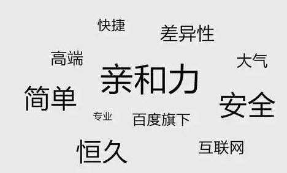

# 百度钱包品牌LOGO设计过程全揭秘

LOGO源于logotype的简略说法，在以前指的是一家公司的签名或符号，而随着行业的发展，LOGO变成了产品对外形象的重要窗口，同时起到对产品识别和推广的作用，通过形象的LOGO可以让用户记住产品主体和品牌文化，重要性不言而喻，很多传统企业及越来越多的互联网公司都十分重视自己品牌的LOGO设计，这次我们要帮助百度钱包完成从LOGO到品牌包装的设计。

 ![logo设计软件][]

## 产品背景
　　“百度钱包”是百度旗下唯一支付业务品牌及产品名称。百度钱包打造“随身随付”的“有优惠的钱包”，致力于为消费者打造一个“随身随付”、“优惠无处不在”的钱包，让用户在移动时代轻松享受一站式的支付生活。

## 关键词

## 设计思考
　　百度钱包在行业内还属于初生产品，考虑到目前市场上已经存在了一些高认知度的竞品产品，作为追赶者，LOGO的识别性是我们首要考虑的，其次LOGO也要考虑未来长久的产品定位和品牌承载空间，基于产品的定位、愿景以及未来移动支付无处不在的场景，我们很快想到了将古铜钱币，钱袋子外形等作为LOGO的基础元素。讨论一致后，我们从“百”字和古铜钱、钱袋子几个方向进行草图绘制，输出一批线稿，最终确定以钱币+文字为LOGO主要设计方向。

## 草图阶段
　　　设计方向明确后，我们从多批草图中间取到了一些不错的方案再进行一轮收拢，最终选取一枚再进行细致优化。我们从百度系产品的品牌颜色：经典红色作为了LOGO的唯一主色调。另外目前的设计趋势不断的向简洁和轻快方向发展，因此LOGO也需要考虑这种扁平质感的流行风格。

## LOGO整体释义：包容万象，钱程似锦
　　符号：钱包LOGO整体取意“百”字和钱币的符号。将百字与钱包品牌概念做结合。
　　形：中国书法一笔勾勒“百”字外轮廓，寓意百度钱包支付流畅、通行无阻、一气呵成的极致支付体验的预期与目标。百字形态演绎，与中华第一龙神行结合，意象兼备，和谐达观。龙形抬头朝向东方，表达团队意在成为行业翘楚的决心。横形上部与圆形下方形成钱袋造型。中央结构与外圆内方的古钱币形意融合。包容万象，展现收纳财富的汉仪。上方打空，说明财富拥有无限增值、无限遐想的空间。
　　色：红色是中国吉祥红色，也是百度红蓝品牌色示意；代表吉祥富贵和财富增值。
　　文化：龙形、钱币、红色等中国元素，民族的就是世界的，兼具迈向国际的信心；融入现代感结构元素，代表银行为主的传统行业与生活方式，将由创新互联网很支付来重新定义的趋势。

## 定稿方案

## 品牌色定义
　　红色是百度钱包品牌色，同时也是百度三大品牌色之一，红色既能体现百度钱包子产品的品牌，也能突出百度的品牌；“钱包红”和“百度红”两种颜色整体饱和度过高，在产品中大面积使用后，长时间的阅读会产生压抑和抵触感，所以在两种品牌色基础上，加入“百度白”进行融合。经过对融合颜色的尝试和筛选，最终确定百度钱包移动页面红色为：#e94643，为品牌定义色。

## 品牌元素提炼
　　圆形：在整个圆形为基础元素的logo设计中，针对logo中的圆形元素，进行发散和尝试，对页面中的部分元素和空间，以圆形形式展现，贴合品牌特性，贴合钱包的形象。
　　圆角方形：圆角方形作为logo形象中的一部分，具有点睛的作用，是整个logo圆润形象的特殊形状，同时方形的圆角又与整体的圆润感协调呼应
　　唯一主色调：红色为整个视觉的唯一主色调，风格元素和重点突出元素以红色为唯一主色。
　　扁平化：结合目前移动端扁平化流行趋势，确定钱包整体视觉风格，简洁而轻薄，在页面元素模块中尽量突出轻薄的风格。

## H5网站品牌化
　　提炼的品牌元素为我们的H5网站改版提供了方向，我们为H5站绘制了一套图标，融入了圆角方形、solgan和钱包品牌色，整体的界面设计尽量轻量化、扁平化，显得没有负担。

## 延展品

## 结尾
　　这次的品牌设计过程整体比较顺畅，得益于小伙伴们对业务定位的清晰理解及设计方案前期的发散自由讨论，在实际设计过程之中，很多东西都是不太好用语言表达出来的，有时候仅仅是心理的某种直觉，更多的时候是不停地讨论与反复修改得到的。感谢一同参与方案的小伙伴以及在项目过程中给予宝贵意见的各位朋友，钱包的品牌建设和业务成长是件长期的事情，钱包UE团队任重而道远，我们刚起跑在路上！

## 参考

http://www.ittribalwo.com/article/2914.html

 [logo设计软件]: images/baidu-logo/1.jpg
